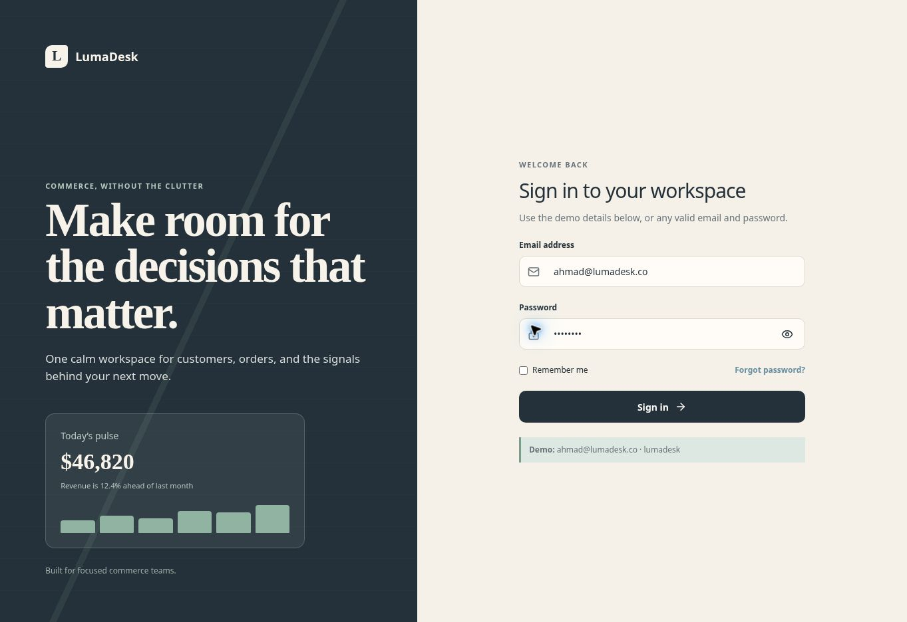
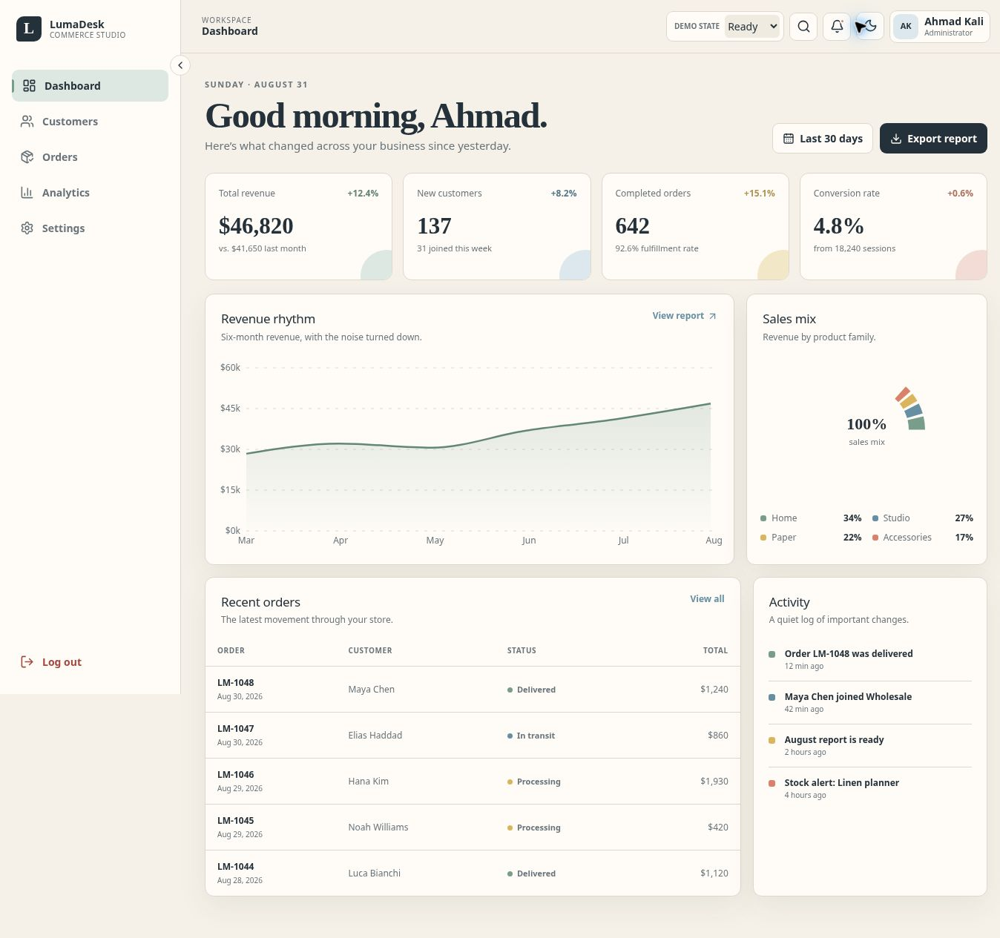
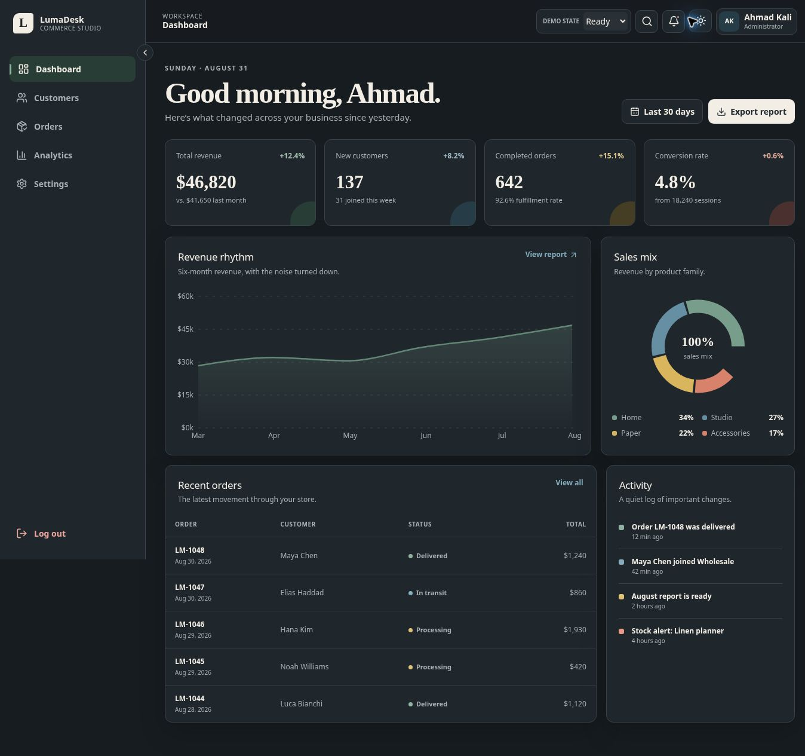
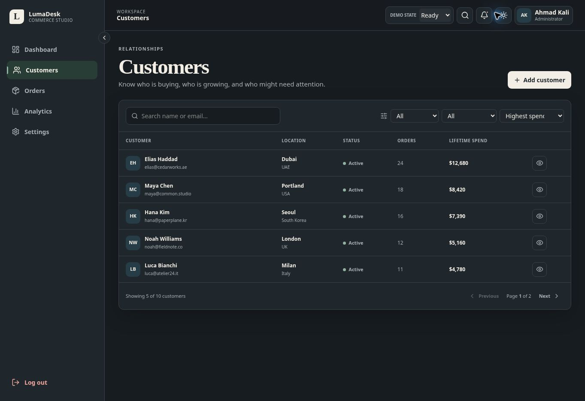

# LumaDesk Commerce Dashboard

LumaDesk is a responsive, portfolio-ready commerce operations dashboard for customers, orders, analytics, and workspace settings. Its calm editorial design avoids the usual generic admin-template look while keeping dense business information easy to scan.

## Live Demo

[Open the deployed dashboard](https://lumadesk-dashboard.yaah618.chatgpt.site)

Demo credentials:

- Email: `ahmad@lumadesk.co`
- Password: `lumadesk`

## Screenshots

### Login



### Dashboard — light theme



### Dashboard — dark theme



### Customers



## Features

- Responsive application shell with collapsible desktop sidebar and accessible mobile drawer
- Demo login with client-side validation and loading feedback
- Dashboard KPIs, revenue trends, sales mix, recent orders, and activity
- Customer search, filtering, sorting, pagination, and details dialog
- Order search, fulfillment filters, sorting, pagination, and details dialog
- Responsive Recharts analytics with legends, labels, and contextual insight
- Profile, business, notifications, appearance, regional, and security settings
- Persistent dark/light theme
- Reviewable ready, loading, empty, and error states
- Mobile-friendly table cards at narrow breakpoints
- Accessible labels, focus states, semantic structure, keyboard interactions, and reduced-motion support

## Tech Stack

- React 19
- TypeScript
- React Router
- Recharts
- Tailwind CSS foundation with a custom design system
- Lucide React icons
- Vinext / Vite production runtime

## Routes

| Route | Purpose |
| --- | --- |
| `/login` | Demo sign-in and validation |
| `/dashboard` | Commerce overview and KPIs |
| `/customers` | Customer table and details |
| `/orders` | Orders and transactions |
| `/analytics` | Reports, charts, and insights |
| `/settings` | Workspace preferences |

Unknown routes display a designed 404 view.

## Run Locally

Requirements:

- Node.js 22.13 or newer

```bash
npm ci
npm run dev
```

Open the URL printed in the terminal.

## Production Build

```bash
npm run lint
npm run build
```

## Project Structure

```text
app/                     Hosting entry route and global styles
src/
├── components/          Reusable application and UI components
├── data/                Typed local demo data
├── state/               Shared demo-state context
├── views/               Routed application views
├── DashboardApp.tsx     Router and application composition
├── DashboardClient.tsx  Client runtime boundary
└── types.ts             Shared TypeScript types
public/
└── screenshots/         Portfolio screenshots
```

## Accessibility

- Semantic headings, navigation, tables, forms, and regions
- Explicit form labels and connected validation feedback
- Visible keyboard focus
- Accessible names for icon-only controls
- Focus-managed dialogs and mobile drawer
- Escape-key dismissal through accessible primitives
- Status text and symbols that do not depend on color alone
- Reduced-motion media query
- Comfortable mobile touch targets

## Data States

Use the **Demo state** selector in the top bar to review:

- Ready
- Loading skeleton
- Empty state
- Error state with retry

Search fields also expose no-results states.

## Deployment

The project is prepared for deployment on Vercel, Netlify, GitHub Pages, or a compatible React hosting platform. The catch-all host route preserves React Router pages on direct refresh.

## Known Limitations

- Authentication and data are intentionally simulated for a frontend portfolio demo.
- Actions such as creating customers, exporting reports, and password changes are presentational.
- Theme selection inside Settings is presentational; the working theme toggle is in the top bar.

## Suggested Commit History

```text
chore: initialize React dashboard
feat: build reusable application shell
feat: add responsive navigation and themes
feat: implement customer and order tables
feat: add analytics charts and data states
docs: complete README and screenshots
```
